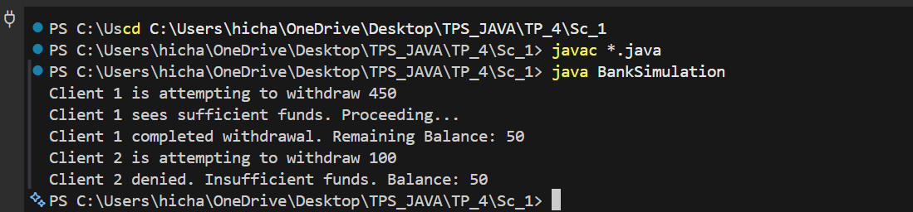
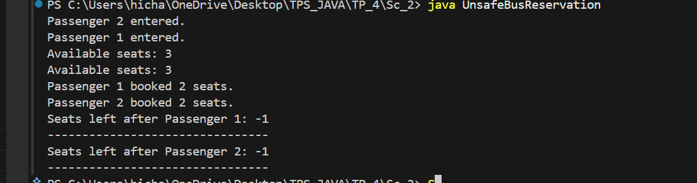
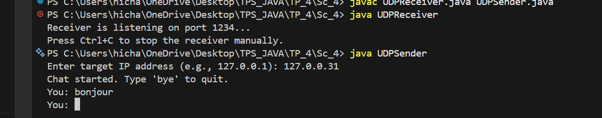

# TP_4: Java Multithreading & Network Programming

This document contains a detailed description of all exercises in TP_4, covering concepts of multithreading, thread synchronization, network programming (TCP/IP and UDP).

---

## Table of Contents
1. [Sc_1: Bank Simulation (Race Condition & Synchronization)](#sc_1-bank-simulation)
2. [Sc_2: Unsafe Bus Reservation (Race Condition)](#sc_2-unsafe-bus-reservation)
3. [Sc_3: Game Server & Client (TCP/IP)](#sc_3-game-server--client)
4. [Sc_4: UDP Communication](#sc_4-udp-communication)

---

## Sc_1: Bank Simulation

### 📋 General Description
This exercise demonstrates the problem of **race condition** in a multithreading environment and how to solve it with synchronization.

### 🎯 Objectives
- Understand **race conditions** in Java
- Learn to use `synchronized` to protect critical sections
- See how synchronization prevents data inconsistencies

### 📂 Files
- `Sc_1/BankSimulation.java`

### 📝 Detailed Code

#### Class `BankAccount`
```java
private int balance;  // Account balance - shared resource

// SYNCHRONIZED method to protect concurrent access
public synchronized void withdraw(int amount, String clientName)
```
- **Problem without `synchronized`**: Two clients can check the balance simultaneously, see that it's sufficient, then both withdraw without being aware of each other
- **Solution with `synchronized`**: Only one thread at a time can execute this method

#### Class `Client` (extends `Thread`)
- Each client is an independent thread
- Calls `withdraw()` on the shared account

#### Method `main()`
```
Initial BankAccount = 500
Client 1: withdraw 450
Client 2: withdraw 100
```

### 🔴 Scenario without Synchronization (Race Condition)
```
TIME     CLIENT 1                          CLIENT 2
T0       Check balance = 500 ✓             -
T1       -                                  Check balance = 500 ✓
T2       Withdraw 450, balance = 50        -
T3       -                                  Withdraw 100, balance = 400 ❌ INCORRECT!
```
**Expected result**: 500 - 450 - 100 = -50 (impossible) or invalid balance
**Actual result**: Inconsistency

### 🟢 Scenario with Synchronization
```
TIME     CLIENT 1                          CLIENT 2
T0       [LOCK]                            -
T1       Check balance = 500 ✓             [WAITING]
T2       Withdraw 450, balance = 50        [WAITING]
T3       [UNLOCK]                          [LOCK]
T4       -                                  Check balance = 50 ✗
T5       -                                  Rejection (insufficient funds)
T6       -                                  [UNLOCK]
```
**Result**: Consistent balance = 50

### 🚀 How to Execute

#### Compilation
```bash
cd Sc_1
javac BankSimulation.java
```

#### Execution
```bash
java BankSimulation
```

### 📊 Expected Output
```
Client 1 is attempting to withdraw 450
Client 1 sees sufficient funds. Proceeding...
Client 1 completed withdrawal. Remaining Balance: 50
Client 2 is attempting to withdraw 100
Client 2 denied. Insufficient funds. Balance: 50
```

### 📸 Screenshot - Sc_1


### 🎓 Key Concepts Learned
- **Race Condition**: When multiple threads access a shared resource without synchronization
- **Critical Section**: Code that accesses shared data
- **Lock/Mutex**: Mechanism to ensure exclusive access
- **`synchronized` Keyword**: Protects a method or block of code

---

## Sc_2: Unsafe Bus Reservation

### 📋 General Description
This exercise shows how a **race condition** can cause overbooking of seats in a bus reservation system.

### 🎯 Objectives
- Identify concurrency issues in critical systems
- Understand the importance of synchronization for business operations
- See the real consequences of poor synchronization

### 📂 Files
- `Sc_2/UnsafeBusReservation.java`

### 📝 Detailed Code

#### Class `Bus`
```java
private int availableSeats;  // Number of available seats

// WITHOUT synchronization - causes race condition
public void bookSeats(int seatsRequested, String passengerName)
```
- **Problem**: The method is not `synchronized`
- **Thread.sleep(100)**: Simulates processing delay to force the race condition

#### Class `Passenger` (extends `Thread`)
- Represents a passenger reserving seats
- Each passenger is a thread

#### Scenario in `main()`
```
Bus total = 3 seats
Passenger 1: wants 2 seats
Passenger 2: wants 2 seats
Total requested: 4 seats (> capacity!)
```

### 🔴 Bug Scenario (Race Condition)

```
TIME     PASSENGER 1                       PASSENGER 2
T0       Check: 3 seats >= 2 ✓            -
T1       (Thread.sleep)                    Check: 3 seats >= 2 ✓
T2       -                                  (Thread.sleep)
T3       Book 2, seats = 1                 -
T4       -                                  Book 2, seats = -1 ❌ BUG!
```

### 📊 Expected Output (With Bug)
```
Passenger 1 entered.
Available seats: 3
Passenger 2 entered.
Available seats: 3
Passenger 1 booked 2 seats.
Seats left after Passenger 1: 1
Passenger 2 booked 2 seats.
Seats left after Passenger 2: -1
```

**Problem**: The bus now has **-1 seats** - impossible situation!

### 🔧 How to Fix
Add `synchronized` to the method:
```java
public synchronized void bookSeats(int seatsRequested, String passengerName) {
    // ... code ...
}
```

### 🚀 How to Execute

#### Compilation
```bash
cd Sc_2
javac UnsafeBusReservation.java
```

#### Execution
```bash
java UnsafeBusReservation
```

### 📸 Screenshot - Sc_2


### 🎓 Key Concepts Learned
- **Data Race**: Unsynchronized access to shared data
- **Overselling**: Selling more than available capacity
- **Atomicity**: Importance of complete operations not being interrupted
- **Critical Section Protection**: Need to protect atomic operations

---

## Sc_3: Game Server & Client

### 📋 General Description
This exercise implements a **magic number guessing game** with **client-server architecture** using TCP/IP (sockets).

### 🎯 Objectives
- Learn TCP/IP network communication in Java
- Implement a server accepting a single connection
- Implement a multithreading server for multiple simultaneous clients
- Create a thread-safe leaderboard system
- Understand client-server programming

### 📂 Files
- `Sc_3/SimpleServer.java` - Simple server (single client)
- `Sc_3/MultiThreadedServer.java` - Multi-client server + leaderboard
- `Sc_3/GameClient.java` - Client to play the game

---

### 📝 SimpleServer - Simple Server

#### Description
TCP server that accepts **a single client** and plays the magic number guessing game.

#### Operation
1. Generates a random number between 0 and 100
2. Listens on port **1234**
3. Accepts a client connection
4. Loop: receives guesses and sends hints
5. Terminates when the client finds the number

#### Key Code
```java
ServerSocket serverSocket = new ServerSocket(port);
Socket socket = serverSocket.accept();  // Blocks until connection
BufferedReader input = new BufferedReader(new InputStreamReader(socket.getInputStream()));
PrintWriter output = new PrintWriter(socket.getOutputStream(), true);
```

#### Hints Sent
- `"TOO_LOW"` - The number is larger
- `"TOO_HIGH"` - The number is smaller
- `"CORRECT"` - The number is found
- `"INVALID_INPUT"` - Invalid input

#### Limitation
❌ Can only serve **one client at a time**

---

### 📝 MultiThreadedServer - Multi-Client Server

#### Description
Advanced TCP server that accepts **multiple clients simultaneously** and manages a **leaderboard**.

#### Improvements
1. **Accepts connections in infinite loop**
   ```java
   while (true) {
       Socket socket = serverSocket.accept();
       new PlayerHandler(socket).start();  // Creates a thread for each client
   }
   ```

2. **Thread-Safe Leaderboard**
   ```java
   private static final List<String> leaderboard = new CopyOnWriteArrayList<>();
   ```
   - `CopyOnWriteArrayList`: Thread-safe collection to avoid race conditions

3. **Inner Class `PlayerHandler`** (extends `Thread`)
   - Each instance manages a player
   - Communicates with its client via I/O streams
   - Records scores in the leaderboard

#### Features
- Asks for **player name**
- Counts **attempts**
- Sorts leaderboard by **ascending attempts** (better score = fewer attempts)
- Displays **Top 5** of leaderboard to the player

#### Key Code - Leaderboard Sorting
```java
leaderboard.sort((a, b) -> {
    int scoreA = Integer.parseInt(a.split(" ")[0]);
    int scoreB = Integer.parseInt(b.split(" ")[0]);
    return scoreA - scoreB;  // Ascending
});
```

#### ✅ Advantage
✅ Accepts **multiple clients simultaneously**
✅ Each client has its own **magic number**
✅ Leaderboard is **shared** and **thread-safe**

---

### 📝 GameClient - Player Client

#### Description
TCP client that connects to the server and plays the magic number guessing game.

#### Operation
1. Connects to server on `localhost:1234`
2. Sends guesses to the server
3. Receives hints from the server
4. Loops until finding the number (response = `"CORRECT"`)
5. Displays the number of attempts

#### Key Code
```java
Socket socket = new Socket(hostname, port);
PrintWriter output = new PrintWriter(socket.getOutputStream(), true);
BufferedReader input = new BufferedReader(new InputStreamReader(socket.getInputStream()));
Scanner console = new Scanner(System.in);

do {
    String guess = console.nextLine();
    output.println(guess);  // Send
    String response = input.readLine();  // Receive
    System.out.println("Server says: " + response);
} while (!response.equals("CORRECT"));
```

#### Input/Output Flow
```
CLIENT                                SERVER
                 ← Connection Established ←
Send "50"        → Receive "50"
                 Check 50 vs number
Receive "TOO_LOW" ← Send "TOO_LOW"
```

---

### 🚀 How to Execute Sc_3

#### Step 1: Compile all files
```bash
cd Sc_3
javac *.java
```

#### Step 2 (Option A): Use SimpleServer
```
Terminal 1:
java SimpleServer

Terminal 2:
java GameClient
```

#### Step 2 (Option B): Use MultiThreadedServer
```
Terminal 1:
java MultiThreadedServer

Terminal 2:
java GameClient

Terminal 3:
java GameClient  # Second player simultaneously
```

### 📊 Example SimpleServer Session
```
[SERVER]
Server is listening on port 1234
Client connected!
Client won in 7 attempts.

[CLIENT]
Connected to the Magic Number Server!
Enter your guess (0-100): 50
Server says: TOO_LOW
Enter your guess (0-100): 75
Server says: TOO_HIGH
Enter your guess (0-100): 62
Server says: TOO_LOW
...
Enter your guess (0-100): 67
Server says: CORRECT
Congratulations! You found the number in 7 attempts.
```

### 📸 Screenshot - Sc_3


### 📊 Example MultiThreadedServer Session
```
[SERVER]
Multi-threaded Server Started...
New player connected: 127.0.0.1
New player connected: 127.0.0.1

[CLIENT 1]
Connected to the Magic Number Server!
WELCOME! Enter your name:
Alice
Enter your guess (0-100): 50
Server says: TOO_HIGH
...
Server says: CORRECT
--- LEADERBOARD ---
1. 5 attempts - Alice
2. 8 attempts - Bob
END_LB
Congratulations! You found the number in 5 attempts.

[CLIENT 2]
WELCOME! Enter your name:
Bob
Enter your guess (0-100): 45
...
```

### 🎓 Key Concepts Learned
- **ServerSocket & Socket**: TCP/IP communication
- **Stream I/O**: `BufferedReader` and `PrintWriter`
- **Threading**: Managing multiple clients
- **Thread-Safe Collections**: `CopyOnWriteArrayList`
- **Client-Server Architecture**: Separation of concerns
- **Protocol Design**: Standardized messages (TOO_LOW, TOO_HIGH, CORRECT)

---

## Sc_4: UDP Communication

### 📋 General Description
This exercise demonstrates **UDP (User Datagram Protocol)** communication in Java - a connectionless and unreliable protocol, unlike TCP.

### 🎯 Objectives
- Understand the difference between UDP and TCP
- Implement a **UDP receiver** (server)
- Implement a **UDP sender** (client)
- Learn to use `DatagramSocket` and `DatagramPacket`
- See the advantages and disadvantages of UDP

### 📂 Files
- `Sc_4/UDPReceiver.java` - UDP Receiver (server)
- `Sc_4/UDPSender.java` - UDP Sender (client)

---

### 📝 UDPReceiver - Server Receiver

#### Description
Program that **listens** on a UDP port and displays all received messages.

#### Operation
```
1. Creates a DatagramSocket on port 1234
2. Infinite loop: listens for incoming UDP packets
3. Displays sender's IP address and port
4. Displays received message
5. Can stop with Ctrl+C or "exit" message
```

#### Detailed Code
```java
DatagramSocket socket = new DatagramSocket(1234);  // Listening port
byte[] buffer = new byte[1024];  // Buffer to receive data
DatagramPacket packet = new DatagramPacket(buffer, buffer.length);

socket.receive(packet);  // Blocks until data arrives
String message = new String(packet.getData(), 0, packet.getLength());
String sender = packet.getAddress().getHostAddress();
int senderPort = packet.getPort();
```

#### UDP Advantages
- **Speed**: No handshake (TCP requires 3)
- **Lightweight**: Less network overhead
- **Ideal for**: Audio/video streaming, real-time games

#### UDP Disadvantages
- **Unreliable**: Packets can be lost
- **Unordered**: Packets can arrive out of order
- **No connection**: No guarantee receiver exists

### 🚀 Execute UDPReceiver
```bash
cd Sc_4
javac UDPReceiver.java
java UDPReceiver
```

### 📊 Output
```
Receiver is listening on port 1234...
Press Ctrl+C to stop the receiver manually.
Received from [127.0.0.1:52345]: Hello World
Received from [127.0.0.1:52346]: Test message
Received from [192.168.1.100:52347]: Message from another computer
```

---

### 📝 UDPSender - Client Sender

#### Description
Program that sends UDP messages to a specified receiver.

#### Operation
```
1. Asks user for target IP address
2. Creates a DatagramSocket (no need to accept connections)
3. Loop: Reads user messages and sends via UDP
4. Stops if user types "bye"
```

#### Detailed Code
```java
DatagramSocket socket = new DatagramSocket();  // Random source port

System.out.print("Enter target IP address: ");
String ipInput = scanner.nextLine();
InetAddress address = InetAddress.getByName(ipInput);
int port = 1234;  // Receiver's port

byte[] buffer = message.getBytes();
DatagramPacket packet = new DatagramPacket(buffer, buffer.length, address, port);
socket.send(packet);
```

#### Difference from TCP/Client
```
TCP (Sc_3)                          UDP (Sc_4)
├─ Socket.connect()                ├─ No connection
├─ Streams (input/output)           ├─ Datagram packets
├─ Reliable and ordered             ├─ Unreliable, no order
├─ Slower (more control)            ├─ Faster
└─ Ideal: Download, email           └─ Ideal: Real-time chat, game
```

### 🚀 How to Execute Sc_4

#### Step 1: Compile
```bash
cd Sc_4
javac UDPReceiver.java
javac UDPSender.java
```

#### Step 2: Launch programs

Terminal 1 (Receiver):
```bash
java UDPReceiver
```

Terminal 2 (Sender):
```bash
java UDPSender
```

### 📊 Example Session
```
[TERMINAL 1 - UDPReceiver]
Receiver is listening on port 1234...
Press Ctrl+C to stop the receiver manually.
Received from [127.0.0.1:58234]: Hello from UDP!
Received from [127.0.0.1:58234]: This is a test message
Received from [127.0.0.1:58234]: exit
Exit command received. Shutting down.

[TERMINAL 2 - UDPSender]
Enter target IP address (e.g., 127.0.0.1): 127.0.0.1
Chat started. Type 'bye' to quit.
You: Hello from UDP!
You: This is a test message
You: exit
Terminating chat...
```

### 📸 Screenshot - Sc_4


### 🎓 Key Concepts Learned
- **UDP vs TCP**: Reliability vs Speed
- **DatagramSocket**: UDP socket
- **DatagramPacket**: UDP data unit
- **Connectionless Protocol**: No connection establishment
- **Network Addresses**: `InetAddress`, IP/Host conversions
- **Stateless Communication**: Each packet is independent

---

## Comparative Summary

| Aspect | Sc_1 | Sc_2 | Sc_3 | Sc_4 |
|--------|------|------|------|------|
| **Main Concept** | Synchronization | Race Condition | TCP/IP | UDP |
| **Type** | Multithreading | Multithreading | Network | Network |
| **Problem** | Concurrent access | Overbooking | Single connection | Unreliable |
| **Solution** | `synchronized` | `synchronized` | Threads/Leaderboard | Datagram |
| **Ports** | N/A | N/A | 1234 | 1234 |
| **Protocol** | Shared Memory | Shared Memory | TCP Stream | UDP Packet |

---

## 📸 Screenshots Summary

All screenshots for each exercise are integrated in the document:
- ✅ **Sc_1**: BankSimulation output with synchronization
- ✅ **Sc_2**: UnsafeBusReservation showing race condition
- ✅ **Sc_3**: Execution of game server and client
- ✅ **Sc_4**: UDP communication (sender & receiver)

---

## 🎓 Conclusion

This TP covers fundamental concepts of concurrent and network programming in Java:
- ✅ Multithreading and synchronization
- ✅ Race conditions and deadlocks
- ✅ TCP/IP network programming
- ✅ UDP network programming
- ✅ Client-server architecture
- ✅ Thread-safe collections

These concepts are essential for developing robust, scalable, and performant applications.

---

**Author**: TP_4 Student
**Date**: January 2026
**Language**: Java
