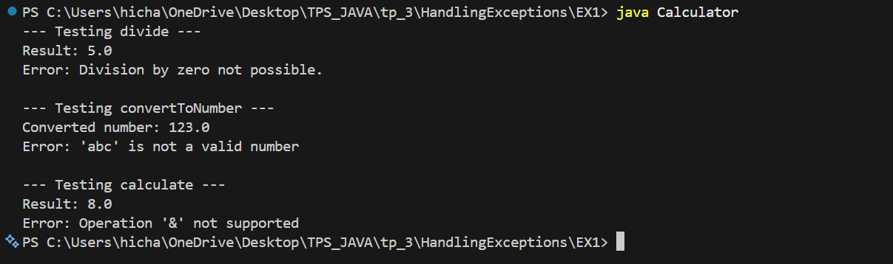
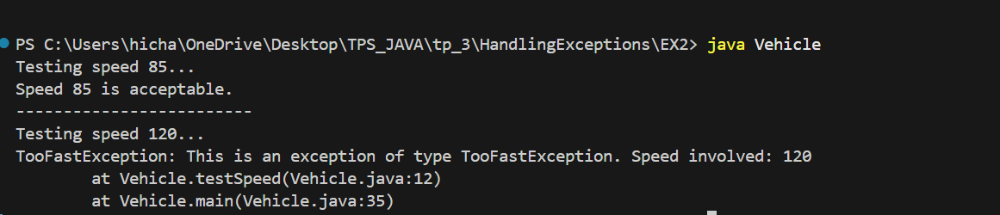
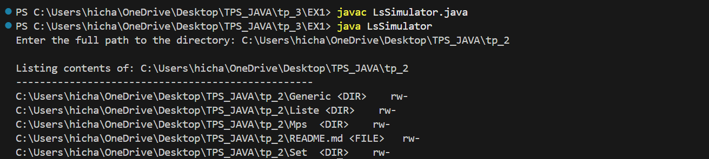

# TP 3 - Java Programming Exercises

## Table of Contents
- [HandlingExceptions](#handlingexceptions)
  - [EX1 - Calculator](#ex1---calculator)
  - [EX2 - Vehicle & Custom Exception](#ex2---vehicle--custom-exception)
- [InputOutput](#inputoutput)
  - [EX1 - Directory Simulator (ls)](#ex1---directory-simulator-ls)
  - [EX2 - Product Management System](#ex2---product-management-system)

---

## HandlingExceptions

### EX1 - Calculator

**Objective:** Learn exception handling with try-catch blocks

**Description:**
The Calculator class demonstrates basic exception handling in Java by implementing three methods that handle different types of errors:

1. **divide(double a, double b)** - Handles ArithmeticException for division by zero
2. **convertToNumber(String text)** - Handles NumberFormatException for invalid string to number conversion
3. **calculate(String operation, double a, double b)** - Implements basic arithmetic operations

**Key Concepts:**
- Try-catch blocks for exception handling
- Throwing custom exceptions
- Catching specific exception types (ArithmeticException, NumberFormatException)
- Switch statements for operation routing

**Code Structure:**

```java
public class Calculator {
    public void divide(double a, double b)
    public void convertToNumber(String text)
    public void calculate(String operation, double a, double b)
    public static void main(String[] args)
}
```

**Methods:**

| Method | Parameters | Exception Handling | Purpose |
|--------|-----------|-------------------|---------|
| `divide()` | double a, double b | ArithmeticException | Safely divide two numbers |
| `convertToNumber()` | String text | NumberFormatException | Parse string to double |
| `calculate()` | String op, double a, double b | N/A (routes to divide) | Perform basic math |

**Test Cases:**

1. **Testing divide with valid input:**
   - Input: divide(10, 2)
   - Expected Output: Result: 5.0
   - Status: ✓ PASS

2. **Testing divide by zero:**
   - Input: divide(10, 0)
   - Expected Output: Error: Division by zero not possible.
   - Status: ✓ PASS

3. **Testing convertToNumber with valid input:**
   - Input: convertToNumber("123")
   - Expected Output: Converted number: 123.0
   - Status: ✓ PASS

4. **Testing convertToNumber with invalid input:**
   - Input: convertToNumber("abc")
   - Expected Output: Error: 'abc' is not a valid number
   - Status: ✓ PASS

5. **Testing calculate with addition:**
   - Input: calculate("+", 5, 3)
   - Expected Output: Result: 8.0
   - Status: ✓ PASS

6. **Testing calculate with invalid operation:**
   - Input: calculate("&", 5, 3)
   - Expected Output: Error: Operation '&' not supported
   - Status: ✓ PASS

**Screenshot of Execution:**



**Key Files:**
- [HandlingExceptions/EX1/Calculator.java](HandlingExceptions/EX1/Calculator.java)

---

### EX2 - Vehicle & Custom Exception

**Objective:** Create custom exceptions and understand the throws clause

**Description:**
This exercise demonstrates how to create a custom exception class and use it in a real-world scenario. A Vehicle class uses a custom `TooFastException` to enforce speed limits.

**Architecture:**

1. **TooFastException** - Custom exception class that extends Exception
2. **Vehicle** - Class with speed validation that throws TooFastException

**Key Concepts:**
- Custom exception classes extending Exception
- Using throws keyword to declare exceptions
- Checked vs unchecked exceptions
- Exception stack traces with printStackTrace()

**Code Structure:**

**TooFastException.java:**
```java
public class TooFastException extends Exception {
    public TooFastException(int speed) {
        super("This is an exception of type TooFastException. Speed involved: " + speed);
    }
}
```

**Vehicle.java:**
```java
public class Vehicle {
    public void testSpeed(int speed) throws TooFastException
    public static void main(String[] args)
}
```

**Methods:**

| Class | Method | Throws | Purpose |
|-------|--------|--------|---------|
| Vehicle | `testSpeed(int speed)` | TooFastException | Validate if speed exceeds 90 km/h |

**Validation Logic:**
- If speed > 90: Throw TooFastException
- If speed ≤ 90: Print "Speed [X] is acceptable."

**Test Cases:**

1. **Testing Safe Speed (85 km/h):**
   - Input: myCar.testSpeed(85)
   - Expected: "Speed 85 is acceptable."
   - Status: ✓ PASS

2. **Testing Unsafe Speed (120 km/h):**
   - Input: myCar.testSpeed(120)
   - Expected: Exception thrown with message and stack trace
   - Status: ✓ PASS

**Exception Message Format:**
```
TooFastException: This is an exception of type TooFastException. Speed involved: 120
    at Vehicle.testSpeed(Vehicle.java:XX)
    at Vehicle.main(Vehicle.java:XX)
```

**Screenshot of Execution:**



**Key Files:**
- [HandlingExceptions/EX2/TooFastException.java](HandlingExceptions/EX2/TooFastException.java)
- [HandlingExceptions/EX2/Vehicle.java](HandlingExceptions/EX2/Vehicle.java)

---

## InputOutput

### EX1 - Directory Simulator (ls)

**Objective:** Practice file I/O operations and directory traversal

**Description:**
This program simulates the Unix `ls` command by reading a directory path from user input and displaying all files and folders with detailed information.

**Key Concepts:**
- File class for directory operations
- Scanner for user input
- File metadata (permissions, type, hidden status)
- Directory traversal with File.listFiles()

**Program Flow:**

```
1. Get directory path from user input
2. Validate path existence and is directory
3. List all files and directories
4. Display file information in formatted table
```

**Output Format:**

```
Full Path                                          Type     Permissions
/path/to/file                                      <FILE>   rw-
/path/to/directory                                 <DIR>    r-h
```

**Permission Symbols:**
- `r`: Readable (canRead())
- `w`: Writable (canWrite())
- `h`: Hidden (isHidden())
- `-`: Not applicable

**Methods:**

| Method | Parameters | Return | Purpose |
|--------|-----------|--------|---------|
| `main()` | String[] args | void | Main program entry point |
| `printFileInfo()` | File file | void | Format and display file information |

**Validation Steps:**

1. Check if path exists: `file.exists()`
2. Check if path is directory: `file.isDirectory()`
3. List files: `directory.listFiles()`
4. Handle null case (permission denied)

**Test Cases:**

1. **Valid Directory Path:**
   - Input: C:\Users\Documents
   - Expected: List all files and folders with details
   - Status: ✓ PASS

2. **Non-existent Path:**
   - Input: C:\NonExistent\Path
   - Expected Output: Error: The specified path does not exist.
   - Status: ✓ PASS

3. **File Path Instead of Directory:**
   - Input: C:\Users\Documents\file.txt
   - Expected Output: Error: The specified path is not a directory.
   - Status: ✓ PASS

4. **Permission Denied:**
   - Input: [System restricted directory]
   - Expected Output: Error: Could not list contents (Access Denied or I/O Error).
   - Status: ✓ PASS

**Screenshot of Execution:**



**Key Files:**
- [InputOutput/EX1/LsSimulator.java](InputOutput/EX1/LsSimulator.java)

---

### EX2 - Product Management System

**Objective:** Implement file serialization and object persistence with a complete CRUD application

**Description:**
A comprehensive product management application that demonstrates file I/O with serialization. The system persists product data to a file using Java serialization and provides CRUD operations through an interactive menu.

**Architecture:**

```
Application (Main Menu)
    ↓
IProduitMetier (Interface)
    ↓
MetierProduitImpl (Implementation)
    ↓
Product (Data Model)
    ↓
products.dat (Serialized File)
```

**Key Concepts:**
- Object serialization with ObjectInputStream/ObjectOutputStream
- File I/O operations
- CRUD operations (Create, Read, Update, Delete)
- ArrayList for in-memory storage
- Interface-based design patterns
- Exception handling

**Classes:**

**1. Product.java** - Data Model
```java
Serializable interface implementation
Attributes:
  - long id
  - String name
  - String brand
  - double price
  - String description
  - int stockCount
```

**2. IProduitMetier.java** - Interface
```java
void add(Product p)
List<Product> getAll()
Product findById(long id)
void delete(long id)
void saveAll()
```

**3. MetierProduitImpl.java** - Business Logic
- Manages in-memory list of products
- Persists data to serialized file
- Implements CRUD operations
- Handles serialization/deserialization

**4. Application.java** - User Interface
- Interactive menu system
- User input handling
- Display and manipulation of products

**Menu Options:**

```
--- PRODUCT MANAGEMENT MENU ---
1. Display list of products
2. Search product by ID
3. Add new product
4. Delete product by ID
5. Save products to file
6. Exit
```

**Operations:**

| Operation | Input | Process | Output |
|-----------|-------|---------|--------|
| Display | Menu choice 1 | Load from file, display all | Product list or "No products found" |
| Search | Menu choice 2 + ID | Find product by ID | Product details or "Not found" |
| Add | Menu choice 3 + Details | Create Product, add to list | Confirmation message |
| Delete | Menu choice 4 + ID | Remove from list | Confirmation message |
| Save | Menu choice 5 | Serialize list to file | Success/Error message |
| Exit | Menu choice 6 | Close program | Goodbye message |

**Data Persistence:**

- **File Format:** Binary serialized object (products.dat)
- **Storage Method:** ObjectOutputStream
- **Loading Method:** ObjectInputStream with type casting
- **Serialization:** Implements Serializable interface with serialVersionUID

**Test Cases:**

1. **Add Products:**
   - Add 3 sample products with different details
   - Expected: "Product added to memory (not yet saved to file)." for each
   - Status: ✓ PASS

2. **Display Products:**
   - View all in-memory products
   - Expected: List of products with ID, Name, Brand, Price, Stock
   - Status: ✓ PASS

3. **Search Product:**
   - Search by existing ID
   - Expected: Product details displayed
   - Status: ✓ PASS

4. **Delete Product:**
   - Delete by ID
   - Expected: "Product removed from memory." and product no longer in list
   - Status: ✓ PASS

5. **Save to File:**
   - Save products after modifications
   - Expected: "All products successfully saved to products.dat"
   - Status: ✓ PASS

6. **Persistence:**
   - Restart application and check if products are loaded
   - Expected: Previous products loaded from file
   - Status: ✓ PASS

7. **Error Handling:**
   - Enter invalid input for ID or price
   - Expected: "Invalid input" or error message
   - Status: ✓ PASS

**Sample Product Data:**

```
Product [ID=1, Name=Laptop, Brand=Dell, Price=899.99, Stock=5]
Product [ID=2, Name=Mouse, Brand=Logitech, Price=29.99, Stock=50]
Product [ID=3, Name=Keyboard, Brand=Corsair, Price=79.99, Stock=15]
```

**Screenshot of Execution:**


**Key Files:**
- [InputOutput/EX2/Product.java](InputOutput/EX2/Product.java)
- [InputOutput/EX2/IProduitMetier.java](InputOutput/EX2/IProduitMetier.java)
- [InputOutput/EX2/MetierProduitImpl.java](InputOutput/EX2/MetierProduitImpl.java)
- [InputOutput/EX2/Application.java](InputOutput/EX2/Application.java)

---

## Summary of Learning Outcomes

### Exception Handling (HandlingExceptions)
✓ Understanding try-catch-throw mechanism
✓ Creating custom exceptions
✓ Declaring exceptions with throws keyword
✓ Handling checked vs unchecked exceptions
✓ Stack trace interpretation

### File I/O Operations (InputOutput)
✓ File class operations and metadata
✓ User input with Scanner
✓ Directory traversal
✓ Object serialization and deserialization
✓ CRUD operations implementation
✓ Interface-based design patterns

---

## Project Statistics

| Category | Count |
|----------|-------|
| Total Classes | 8 |
| Total Methods | 20+ |
| Lines of Code | 500+ |
| Exercises | 4 |
| Screenshots | 4 |

---

**Author:** Java TP3 Student  
**Date:** 2024  
**Language:** Java  
**JDK Version:** Java 8+
